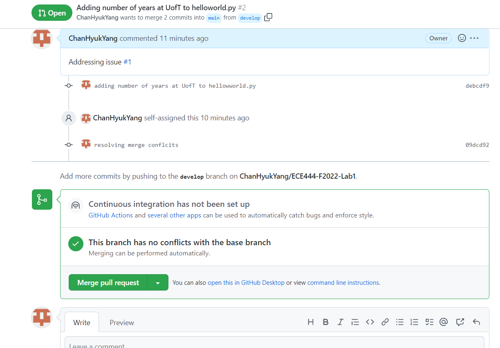

Chan Hyuk Yang
# Activity 1 - Create README.md file

# Activity 2 - Branch and Merge

# Activity 3 - Issues, Pull Requests, Merge Conflicts

# Actiity 4 - Collaborators and Changes
Commit on Richard Yang's [repo](https://github.com/RickyY1689/ECE444-F2022-Lab1.git)

Pull from Richard's push

# Activity 5 - git rebase practice
Checkout to rebase branch, adding 2 empty text files

Checkout to develop branch, adding 2 empty text files

Git rebase command output in rebase branch to rebase off develop, along with log output to confirm correct ordering of commits

Merge changes into develop with log to confirm desired commit history

# Activity 6
[Link](https://github.com/ChanHyukYang/ECE444-F2022-EP) to the cloned Education Pathways Repo
# Activity 7
Screenshot of updated website along with the rebase command

# Activity 8
Screenshot of updated website along with the rebase command

